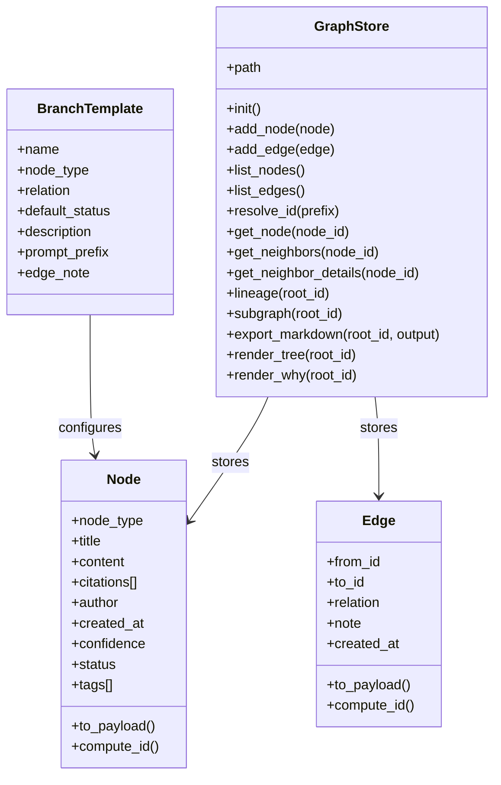
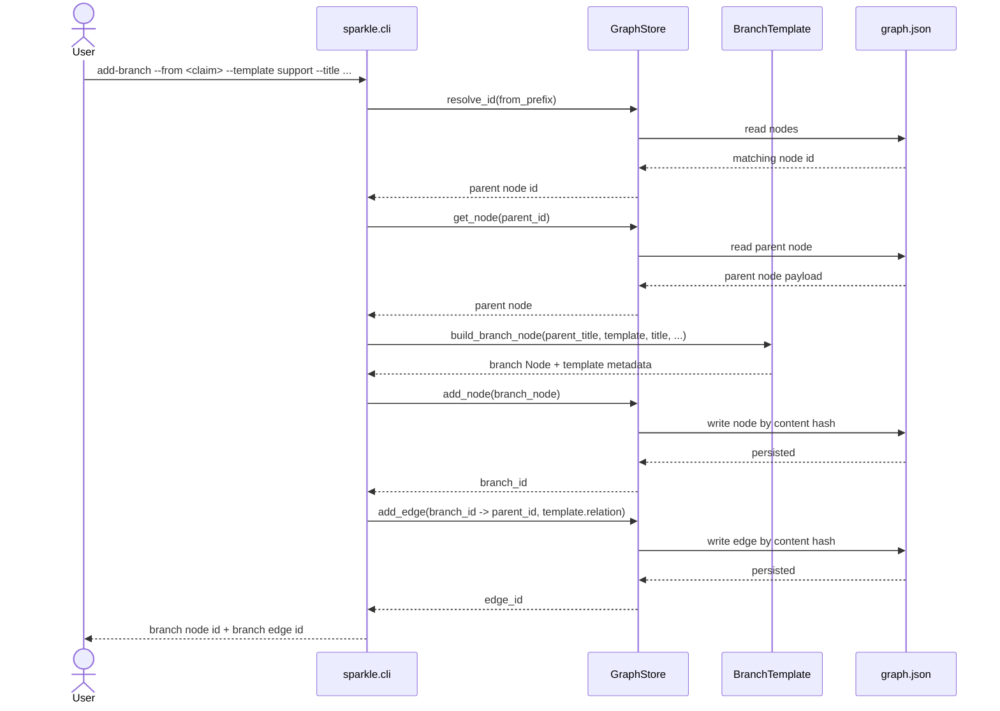
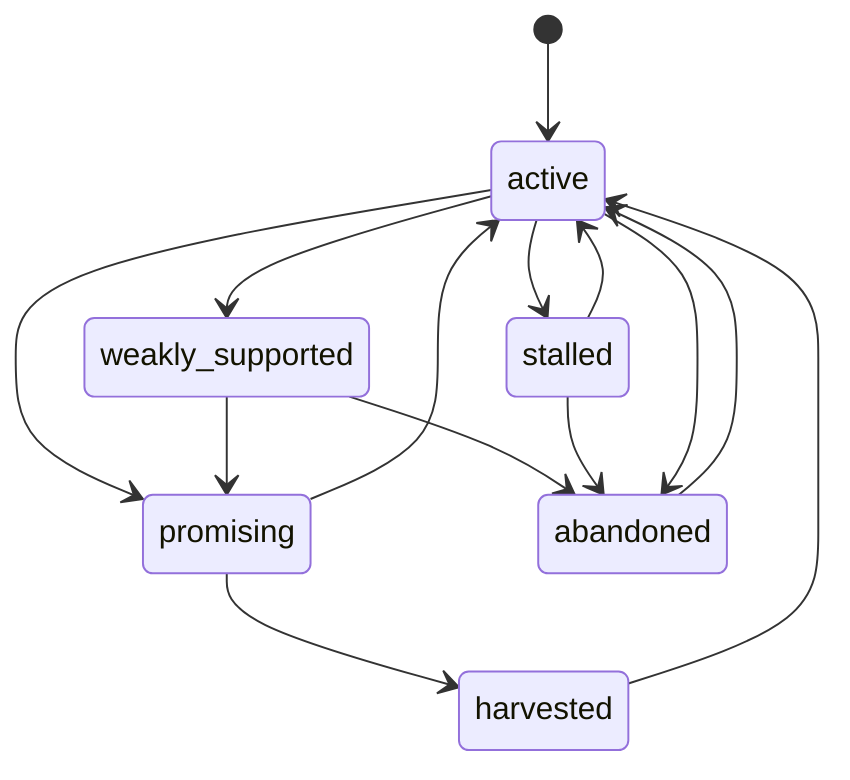

# Sparkle

A research tool that makes claims, evidence, and reasoning traceable — for humans and AI agents.

Instead of scattering research across notes, bookmarks, and chat threads, Sparkle stores it as a typed graph: claims link to evidence, objections, questions, and syntheses. Every conclusion traces back to the path that produced it. Nothing gets lost.

**[See it in action: Does music help you code?](demo/)**

## Why This Exists

Most research tools are good at capture and bad at accountability. Ask yourself:

- What supports this claim? What weakens it?
- What alternative paths did I explore?
- Why did I abandon that line of thinking?
- How exactly did I arrive at this conclusion?

If you can't answer those from your notes, you have a capture tool, not a research tool. Sparkle is the graph layer that makes these questions answerable — by you, by a collaborator reviewing your work, or by an AI agent conducting research on your behalf.

## Where It's Going

The CLI works today. The roadmap is about making it the backend for real research:

| Phase | What | Why |
|-------|------|-----|
| **CLI usability** | `update-node`, `merge`, `undo`, `batch` mode | Can't stop mid-thought to fight the tool |
| **Agent-native** | MCP server, `--format json`, introspection (`gaps`, `tensions`) | Agents need structured I/O, not ASCII parsing |
| **Real citations** | Structured sources, excerpts, DOI/URL, BibTeX interop | Flat strings aren't verifiable sources |
| **Research workflows** | Guided investigation, devil's advocate, confidence propagation | The tool should enforce good research hygiene |

The highest-leverage item is the **MCP server** — it turns Sparkle from "a CLI you shell out to" into a tool any AI agent can use natively during research.

See [`docs/roadmap.md`](docs/roadmap.md) for the full plan.

## Quick Start

```bash
git clone <repo> && cd sparkle

# Initialize a graph store
PYTHONPATH=src python3 -m sparkle init

# Seed with an example graph
PYTHONPATH=src python3 -m sparkle bootstrap

# See the dashboard
PYTHONPATH=src python3 -m sparkle home

# Explore
PYTHONPATH=src python3 -m sparkle tree <node_id_prefix>
PYTHONPATH=src python3 -m sparkle show <node_id_prefix>
PYTHONPATH=src python3 -m sparkle why <node_id_prefix>
```

Or explore the pre-built demo graph:

```bash
PYTHONPATH=src python3 -m sparkle --store demo/.sparkle/graph.json home
PYTHONPATH=src python3 -m sparkle --store demo/.sparkle/graph.json tree e036ff896cea
```

## How It Works

### The graph model

Research is a graph of typed nodes connected by typed edges:

- **Nodes**: `claim`, `evidence`, `question`, `objection`, `inference`, `decision`, `synthesis`
- **Edges**: `supports`, `contradicts`, `refines`, `derived_from` (or any custom relation)
- **Status**: `active`, `stalled`, `weakly_supported`, `promising`, `abandoned`, `harvested`
- **IDs**: SHA256 content hashes — same content always produces the same ID, tamper-evident by construction

### Branch templates

Recurring research moves have templates so you don't have to remember node types and relations:

| Template | Creates | Relation | Use when |
|----------|---------|----------|----------|
| `support` | evidence | supports | Adding evidence for a claim |
| `objection` | objection | contradicts | Challenging a claim |
| `reframing` | question | refines | Asking a better question |
| `application` | claim | derived_from | Drawing a practical conclusion |

```bash
PYTHONPATH=src python3 -m sparkle add-branch \
  --from <claim_id> --template support \
  --title "Primary source evidence" \
  --citations "https://example.com/paper"
```

### Storage

All state lives in a single human-readable JSON file (`.sparkle/graph.json`). Nodes and edges are keyed by content hash. Identical payloads collapse to the same ID. The store is immutable in spirit — provenance remains stable as the graph grows.

## CLI Reference

| Command | What it does |
|---------|-------------|
| `init` | Create an empty graph store |
| `bootstrap` | Seed with example nodes from the concept conversation |
| `home` | Dashboard with counts, recent nodes, next actions |
| `add-node` | Create a node with type, title, content, confidence, status, tags |
| `add-edge` | Link two nodes with a relation |
| `add-branch` | Templated node + edge creation for common research moves |
| `list-nodes` | List nodes with filters (type, status, tag, query, limit) |
| `list-edges` | List all edges |
| `list-templates` | Show available branch templates |
| `show` | Inspect a node with all its incoming and outgoing edges |
| `tree` | ASCII tree of a node's immediate neighborhood |
| `why` | Trace inbound provenance chain |
| `lineage` | Walk all inbound ancestors (BFS) |
| `export` | Export a subgraph rooted at a node to markdown |

All commands accept `--store <path>` to use a non-default graph file.

## Architecture

### Source layout

```
src/sparkle/
  __init__.py       # package marker
  models.py         # Node, Edge — frozen dataclasses with content-addressed IDs
  graph.py          # GraphStore — JSON-backed storage, traversal, export
  cli.py            # CLI — argparse commands with input validation
  templates.py      # BranchTemplate — opinionated inquiry workflows
  bootstrap.py      # seeds example graph from concept conversation
  __main__.py       # python -m sparkle entrypoint
tests/
  test_cli.py       # 16 integration tests via unittest
demo/
  README.md         # demo overview with mermaid graph
  WALKTHROUGH.md    # conversational walkthrough of building a claim graph
  exported-research.md  # sparkle export output
  .sparkle/graph.json   # the demo graph (17 nodes, 19 edges)
docs/
  prd.md            # product requirements
  roadmap.md        # what's built, what's next
```

### Diagrams

<details>
<summary>Class model</summary>


</details>

<details>
<summary>Add-branch sequence</summary>


</details>

<details>
<summary>Node status model</summary>


</details>

## Testing

```bash
python3 -m unittest discover -s tests -v
```

16 tests covering: init, bootstrap, node/edge CRUD, branch templates, show/tree/why rendering, filtered listing, home dashboard, lineage, export, error handling (invalid lookups, ambiguous prefixes, out-of-range confidence).

## Current Limits

- No node metadata editing — you have to recreate nodes to change status or confidence
- No merge/supersede — can't express "this synthesis replaced that one"
- No machine-readable output — agents have to parse ASCII
- No MCP server — agents shell out to the CLI
- Citations are flat strings — no structured source metadata
- No graph introspection — the tool doesn't tell you what's missing
- No UI — terminal only
