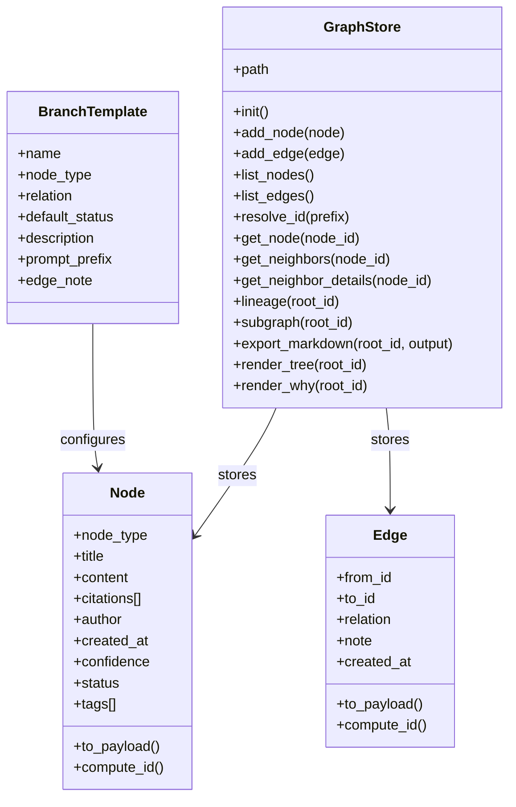
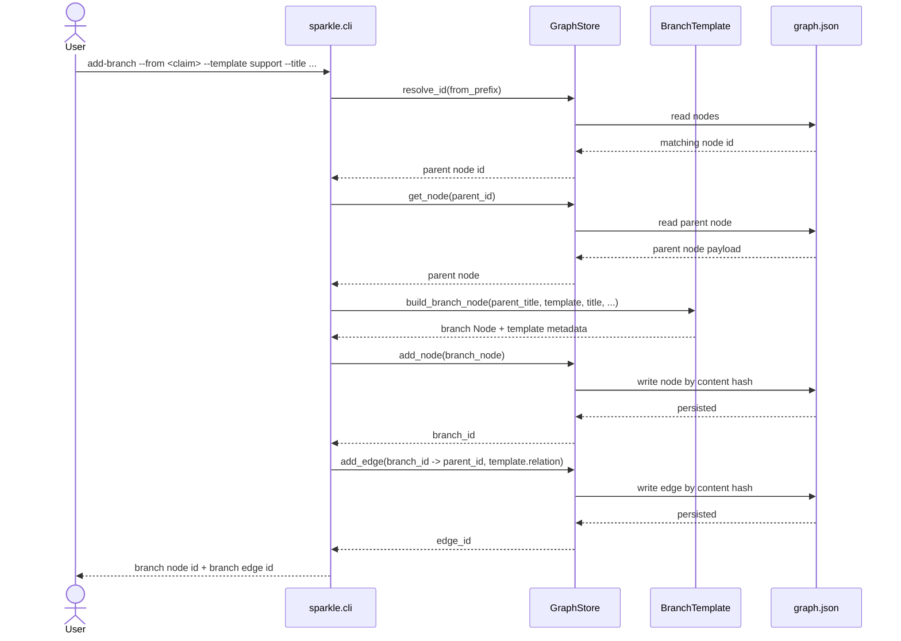
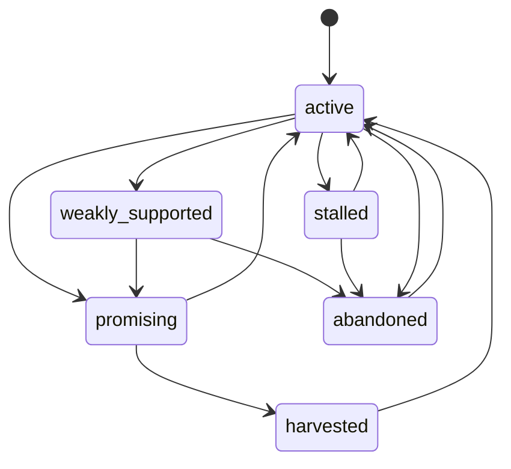

# Sparkle ✨

Sparkle is a local-first solo research tool built as a claim graph on top of content-addressed storage.

The core idea is simple:

- research should branch without losing work
- claims should stay tied to evidence, objections, questions, and syntheses
- final outputs should be traceable back to the path that produced them

This repo is the MVP: a Python CLI that stores typed research nodes in a Merkle-style graph, supports structured branch creation, and exports selected subgraphs into markdown.

## What It Does

Sparkle currently supports:

- typed nodes: `claim`, `evidence`, `question`, `objection`, `inference`, `decision`, `synthesis`
- typed edges between nodes
- deterministic content-derived IDs for nodes and edges
- local JSON storage in `.sparkle/graph.json`
- branch-like status on nodes: `active`, `stalled`, `weakly_supported`, `promising`, `abandoned`, `harvested`
- structured inquiry templates: `support`, `objection`, `reframing`, `application`
- lineage inspection for provenance
- terminal-native tree view for local graph structure
- claim-card style node inspection grouped by relation
- provenance-focused `why` view for inbound reasoning chains
- filtered node listing by type, status, tag, query, and limit
- `home` dashboard for graph counts, recent nodes, and next actions
- markdown export for a selected subgraph
- bootstrap seeding from the original concept conversation

This is not a UI product yet. It is the storage model and CLI workflow needed to prove the idea.

The next usability bar is also not a UI. The goal is to make the terminal experience feel visual, guided, and satisfying enough that the graph is understandable without leaving the CLI.

## Why This Exists

Most note systems are good at capture and weak at disciplined inquiry. Sparkle is trying to answer:

- What supports this claim?
- What weakens it?
- What alternative paths did I explore?
- Why did I abandon or harvest a branch?
- What exact path led to this synthesis?

The operating model is:

- conceptually: claim graph
- operationally: branching research workspace
- technically: content-addressed Merkle-style DAG

## Architecture

### Core data model

- `Node`
  - immutable content payload
  - hash-derived ID
  - type, title, content, citations, author, confidence, status, tags
- `Edge`
  - immutable link payload
  - hash-derived ID
  - `from_id`, `to_id`, `relation`, `note`
- `GraphStore`
  - JSON-backed storage for nodes and edges
  - lookup, lineage traversal, subgraph collection, markdown export
- `BranchTemplate`
  - opinionated workflow layer for recurring inquiry moves

### Source layout

- [`src/sparkle/__init__.py`](src/sparkle/__init__.py): package marker
- [`src/sparkle/models.py`](src/sparkle/models.py): immutable node and edge models with validation
- [`src/sparkle/graph.py`](src/sparkle/graph.py): storage, traversal, export
- [`src/sparkle/cli.py`](src/sparkle/cli.py): command interface with input validation
- [`src/sparkle/templates.py`](src/sparkle/templates.py): structured branch templates
- [`src/sparkle/bootstrap.py`](src/sparkle/bootstrap.py): seeds an example graph from the original concept conversation
- [`src/sparkle/__main__.py`](src/sparkle/__main__.py): enables `python -m sparkle`
- [`tests/test_cli.py`](tests/test_cli.py): automated CLI coverage
- [`demo/`](demo/): music-and-coding claim graph walkthrough with mermaid visualization

## Diagrams

### Class model



### Add-branch sequence

This is the most important workflow-specific behavior in the MVP.



### Research node state model

These statuses are metadata on nodes. They are how the MVP represents branch triage.



## CLI

### Initialize

```bash
PYTHONPATH=src python3 -m sparkle init
```

### Seed the example graph

```bash
PYTHONPATH=src python3 -m sparkle bootstrap
```

### List available branch templates

```bash
PYTHONPATH=src python3 -m sparkle list-templates
```

### Filter node listings

```bash
PYTHONPATH=src python3 -m sparkle list-nodes --status promising
PYTHONPATH=src python3 -m sparkle list-nodes --type objection
PYTHONPATH=src python3 -m sparkle list-nodes --tag origin
PYTHONPATH=src python3 -m sparkle list-nodes --query provenance
PYTHONPATH=src python3 -m sparkle list-nodes --limit 5
```

### Show the dashboard

```bash
PYTHONPATH=src python3 -m sparkle home
```

### Add a node

```bash
PYTHONPATH=src python3 -m sparkle add-node \
  --type claim \
  --title "Merkle DAG structure can improve research provenance" \
  --content "A claim-graph research tool can preserve distinct inquiry paths and make final outputs traceable."
```

### Add a custom edge

```bash
PYTHONPATH=src python3 -m sparkle add-edge \
  --from <from_id_prefix> \
  --to <to_id_prefix> \
  --relation supports
```

### Add a structured branch

```bash
PYTHONPATH=src python3 -m sparkle add-branch \
  --from <claim_id_prefix> \
  --template support \
  --title "Support with source-backed evidence" \
  --citations https://chatgpt.com/c/69b579e3-3cf8-8331-8d8d-185381cbbb01
```

### Inspect a node

```bash
PYTHONPATH=src python3 -m sparkle show <node_id_prefix>
```

### Render a local graph tree

```bash
PYTHONPATH=src python3 -m sparkle tree <node_id_prefix>
```

### Trace lineage

```bash
PYTHONPATH=src python3 -m sparkle lineage <node_id_prefix>
```

### Explain why a node exists

```bash
PYTHONPATH=src python3 -m sparkle why <node_id_prefix>
```

### Export a subgraph

```bash
PYTHONPATH=src python3 -m sparkle export \
  --root <node_id_prefix> \
  --output exports/research-path.md
```

## Storage Model

Sparkle stores graph state as human-readable JSON:

- nodes are stored in a `nodes` map keyed by content hash
- edges are stored in an `edges` map keyed by content hash
- node and edge IDs are deterministic for a given payload

Important implication:

- identical payloads collapse to the same ID
- provenance remains stable
- the storage layer is immutable in spirit, even though the JSON file is rewritten as the store grows

## Branch Templates

The current templates are:

- `support`
  - creates an `evidence` node
  - links it with `supports`
- `objection`
  - creates an `objection` node
  - links it with `contradicts`
- `reframing`
  - creates a `question` node
  - links it with `refines`
- `application`
  - creates a downstream `claim`
  - links it with `derived_from`

Templates add two things on top of raw graph editing:

- a consistent relation and node type
- a starter prompt so the branch begins with a useful research question instead of an empty node

## Example Workflow

1. Initialize the store.
2. Create or bootstrap a root claim.
3. Add evidence, objections, questions, or syntheses directly.
4. Use `add-branch` when the branch is a standard support, objection, reframing, or application move.
5. Use `show` and `lineage` to inspect provenance.
6. Export a selected root into markdown when you want a memo-like artifact.

## Testing

Run:

```bash
python3 -m unittest discover -s tests -v
```

The current automated coverage verifies:

- store initialization
- bootstrap seeding
- node creation with validation (type, status, confidence range)
- edge creation
- branch-template creation
- claim-card style node inspection
- local ASCII tree rendering
- provenance-focused why rendering
- filtered node listing
- home dashboard rendering
- lineage traversal
- export to file and stdout
- invalid lookup handling
- ambiguous prefix handling
- out-of-range confidence rejection

## Current Limits

Not implemented yet:

- node metadata editing (status, confidence, tags) without recreating the node
- merge and supersede workflows for converging syntheses
- MCP server for agent-native access
- structured JSON output for machine consumption
- structured citations with author, year, DOI fields
- graph introspection (gaps, tensions, stale nodes)
- UI or graph visualization
- collaboration or sync

## Next

See [`docs/roadmap.md`](docs/roadmap.md) for the full plan. The short version:

1. **CLI usability** — `update-node`, `merge`, `undo`, `batch` mode, short IDs
2. **Agent-native interface** — MCP server, `--format json`, query language, introspection commands
3. **Real citation management** — structured sources, excerpts, snapshots, BibTeX interop
4. **Research workflows** — guided investigation, devil's advocate, confidence propagation, review triggers
