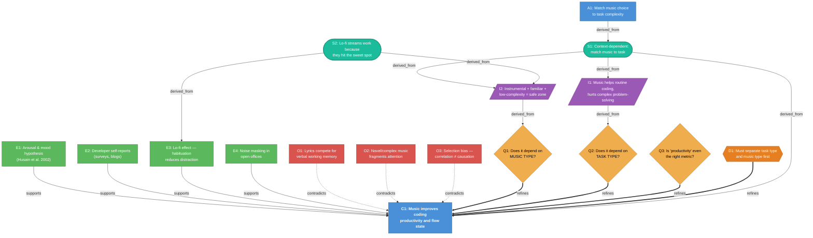

# Demo: Does Music Help You Code?

We used Sparkle to investigate a question every developer argues about. Here's the claim graph.

## The Graph



> **Legend** &mdash;
> Claims (blue) &nbsp; Evidence (green) &nbsp; Objections (red) &nbsp; Questions (yellow) &nbsp; Inferences (purple) &nbsp; Decision (orange) &nbsp; Synthesis (teal)

## The Takeaway

The original claim — "music helps you code" — is too simple. The graph converges on a nuanced answer:

| Task type | Best audio |
|-----------|-----------|
| Routine (tests, refactors, docs) | Instrumental, familiar, low-complexity music (lo-fi, ambient, game OSTs) |
| Complex (debugging, architecture, code review) | Silence or very minimal ambient sound |

Lo-fi hip hop became the unofficial coding soundtrack because it accidentally optimizes for all three safe-zone dimensions: low complexity, no lyrics, instant familiarity.

## What This Demonstrates

This isn't really about music. It's about what happens when you **structure your thinking** instead of arguing from vibes:

- **Evidence + objections** on the same claim reveal that the real question is more nuanced than the hot take
- **Reframing questions** (Q1, Q2) were the actual breakthrough — not more data
- **Dead ends are tracked**, not hidden — Q3 (abandoned) and O3 (stalled) are still in the graph so you know why they were parked
- **Every conclusion traces back to its sources** — `sparkle why` shows provenance, not hand-waving

## Try It Locally

```bash
git clone <this-repo> && cd sparkle

# Dashboard — see all 17 nodes and 19 edges at a glance
PYTHONPATH=src python3 -m sparkle --store demo/.sparkle/graph.json home

# The root claim's neighborhood — evidence, objections, questions all converging
PYTHONPATH=src python3 -m sparkle --store demo/.sparkle/graph.json tree e036ff896cea

# How was the synthesis derived?
PYTHONPATH=src python3 -m sparkle --store demo/.sparkle/graph.json show ae9ed38241fc

# Full detail on any node
PYTHONPATH=src python3 -m sparkle --store demo/.sparkle/graph.json show dac49e388092
```

## What's in This Directory

| File | What it is |
|------|------------|
| [WALKTHROUGH.md](WALKTHROUGH.md) | The full story — a conversational, 5-act walkthrough of building this graph |
| [exported-research.md](exported-research.md) | Sparkle's markdown export of the complete graph (all node content + edges) |
| `.sparkle/graph.json` | The raw graph data — 17 nodes, 19 edges, fully explorable via CLI |

---

*Built with [Sparkle](../README.md) — claim-graph research with content-addressed provenance.*
